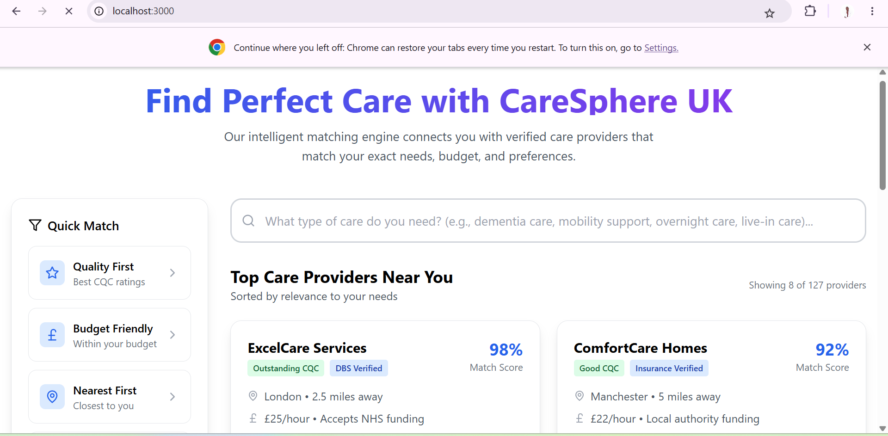
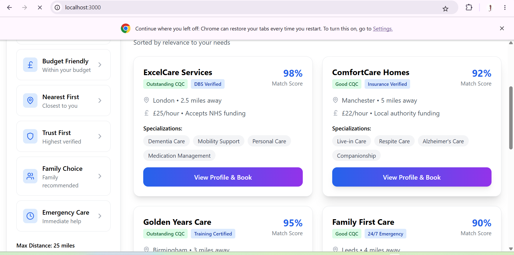
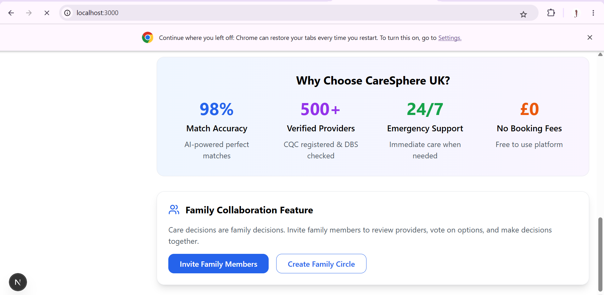
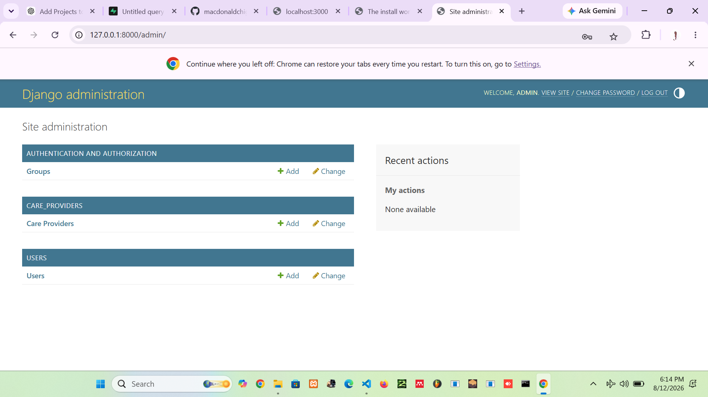

# CareSphere UK

**CareSphere UK** is a full-stack digital care management platform designed to support the organisation and delivery of care services through a modern, scalable web application.

The project combines a **Django/Python backend** with a **Next.js and TypeScript frontend**, supported by Docker-based infrastructure for development and production deployment.

> **Project Status:** 🚧 Active Development

---

## 🏥 About the Project

CareSphere UK is being developed as a modern care-sector management system with a focus on providing a structured digital environment for managing care-related operations.

The project follows a separated frontend/backend architecture, allowing the user interface, business logic and data layer to evolve independently while remaining part of one integrated platform.

---

## ✨ Key Features

The platform is being developed to support:

* Centralised care management
* Administrative dashboards
* User and role management
* Structured care-related records
* Secure backend services
* Responsive web interfaces
* Media and document handling
* API-driven frontend/backend communication
* Containerised development and deployment
* Scalable production infrastructure

Additional functionality will continue to be introduced as the platform develops.

---

## 🛠️ Technology Stack

### Frontend

* Next.js
* React
* TypeScript
* Tailwind CSS
* ESLint
* Prettier

### Backend

* Python
* Django
* Django application architecture
* REST/API-ready backend structure

### Database & Data

* SQLite for local development
* PostgreSQL-ready production infrastructure

### Infrastructure & DevOps

* Docker
* Docker Compose
* Nginx
* PostgreSQL
* Prometheus
* Grafana

### Development Tools

* Git
* GitHub
* VS Code
* npm

---

## 🏗️ Project Architecture

```text
CareSphere-UK/
│
├── caresphere_backend/
│   ├── apps/
│   ├── caresphere_backend/
│   ├── media/
│   ├── migrations/
│   ├── static/
│   ├── templates/
│   ├── tests/
│   ├── manage.py
│   ├── requirements.txt
│   └── Dockerfile
│
├── caresphere_frontend/
│   ├── app/
│   ├── hooks/
│   ├── lib/
│   ├── public/
│   ├── store/
│   ├── styles/
│   ├── types/
│   ├── package.json
│   ├── tailwind.config.js
│   ├── tsconfig.json
│   └── Dockerfile
│
├── docker/
├── docker-compose.yml
├── .gitignore
└── README.md
```

---

## 🚀 Getting Started

### Prerequisites

Make sure you have the following installed:

* Python
* Node.js
* npm
* Git
* Docker and Docker Compose if using the containerised environment

### Clone the Repository

```bash
git clone https://github.com/macdonaldchigutiro/CareSphere-UK.git
cd CareSphere-UK
```

### Backend Setup

```bash
cd caresphere_backend
python -m venv venv
```

Activate the virtual environment on Windows:

```bash
venv\Scripts\activate
```

Install Python dependencies:

```bash
pip install -r requirements.txt
```

Run database migrations:

```bash
python manage.py migrate
```

Start the Django development server:

```bash
python manage.py runserver
```

---

## 💻 Frontend Setup

Open another terminal:

```bash
cd caresphere_frontend
npm install
npm run dev
```

The Next.js frontend can then be accessed through the local development address displayed in the terminal.

---

## 🐳 Docker

The repository includes Docker configuration for containerised development and production-oriented deployment.

Where configured, the application can be started with:

```bash
docker compose up --build
```

The infrastructure directory also contains configuration for services such as:

* Nginx
* PostgreSQL
* Prometheus
* Grafana

---

## 🔐 Environment Variables

Environment files containing credentials and secrets are intentionally excluded from Git.

Use the provided example environment configuration where available:

```text
.env.example
```

Create your own local environment files and never commit passwords, API keys, database credentials or production secrets to the repository.

---

## 📸 Screenshots

### Care Matching & Provider Discovery



### Provider Results & Matching



### Family Collaboration



### Django Administration




---

## 🧪 Testing

The backend contains a dedicated testing structure for validating application functionality as the platform develops.

Further automated testing will be introduced as additional modules are completed.

### CQC care directory discovery

CareSphere can import relevant adult social-care locations from the public CQC
directory and expose them alongside registered CareSphere providers through the
discovery search. See [CQC directory import](docs/cqc-directory-import.md) for
the filtering rules, commands and API parameters.

---

## 🗺️ Roadmap

Future development will focus on:

* Expanding care-management functionality
* Improving role-based access control
* Enhanced dashboards and reporting
* Production database integration
* Improved monitoring and logging
* Automated testing
* Deployment automation
* Performance and security improvements
* Responsive mobile-friendly interfaces

---

## 👨‍💻 Developer

**Macdonald Chigutiro**

Software Developer focused on building practical web, mobile and business information systems.

Technologies include **Next.js, React, TypeScript, Python, Django, Flutter, SQL and Docker**.

---

## 📄 Project Status

CareSphere UK is currently under active development.

The repository represents an evolving software project and will continue to receive new functionality, architectural improvements and documentation updates.
